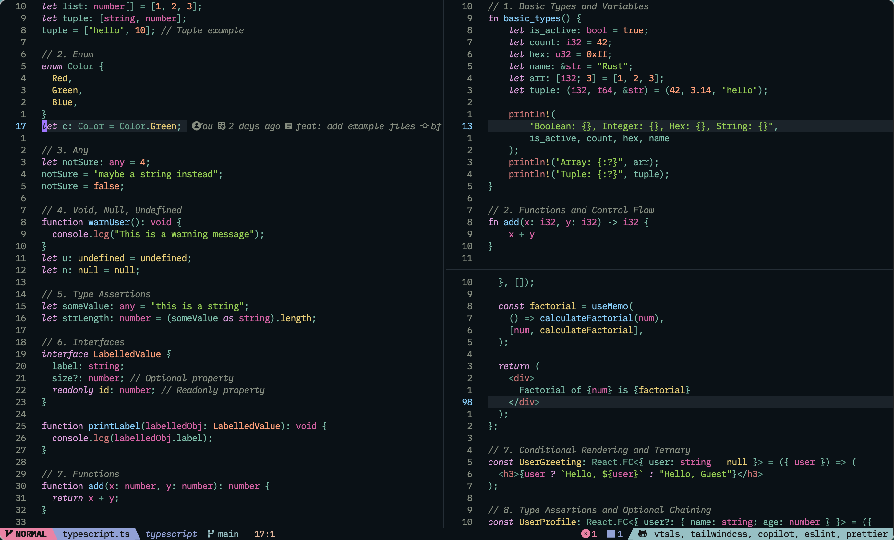
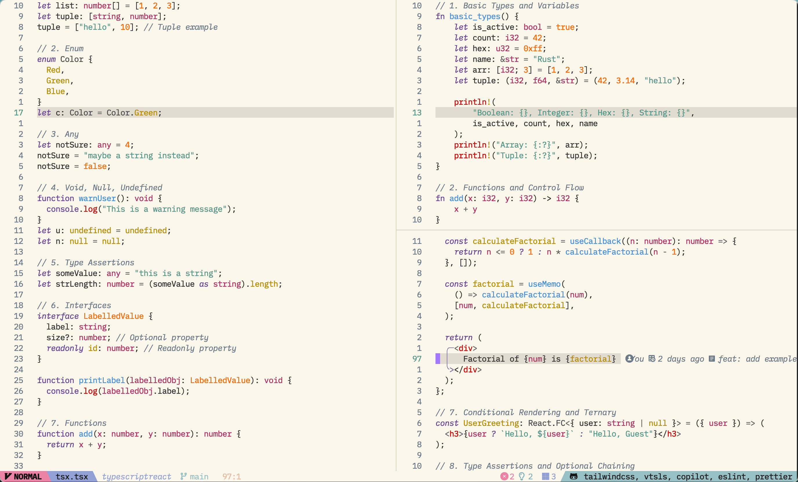
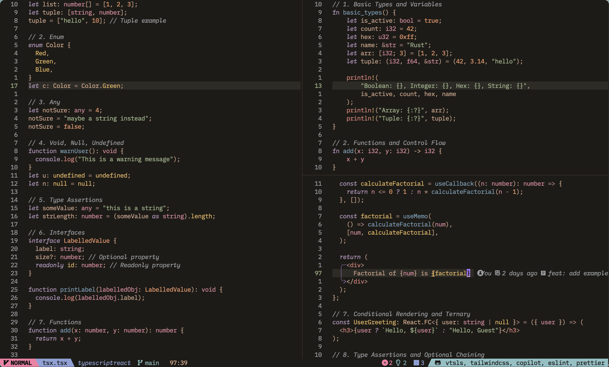
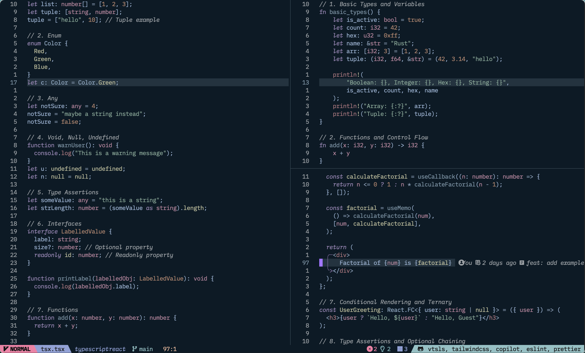

<p align="center">
  
</p>

# Four Symbols Neovim Theme

**Four Symbols** is a series of Neovim themes inspired by the four legendary beasts from ancient Chinese mythology: Azure Dragon, White Tiger, Vermilion Bird, and Black Tortoise. Each theme represents a season and an element, aiming to bring a unique visual experience to the editor.

- **Azure Dragon (青龙)**: Represents the East and Spring, symbolizing vitality and growth. The theme features green, cyan, and bright colors.
- **White Tiger (白虎)**: Represents the West and Autumn, symbolizing strength and majesty. The theme features white and gray.
- **Vermilion Bird (朱雀)**: Represents the South and Summer, symbolizing passion and energy. The theme features red and orange colors.
- **Black Tortoise (玄武)**: Represents the North and Winter, symbolizing stability and cold. The theme features black and blue.

> [!CAUTION]
> This theme is currently in an unstable state. The color choices are largely based on my subjective preferences, and there may be significant changes in the future.

## Features

- **Multiple Theme Options**: Switch between different theme styles based on preference and mood.
- **Highly Customizable**: Offers various configuration options to meet personalization needs.
- **Extensive Plugin Support**: Compatible with major Neovim plugins (e.g., Treesitter, LSP).
- **Carefully Crafted Color Schemes**: Each theme's colors are finely tuned to ensure readability and aesthetics.

## 📷 Preview

### Azure Dragon - 青龙

---


### White Tiger - 白虎


---

### Vermilion Bird - 朱雀


---


### Black Tortoise - 玄武


---


## 📦 Installation

### Using Lazy.vim

```lua
{
	"four-symbols/four-symbols.nvim",
	lazy = false,
	priority = 1000
}
```

## ⚙️ Configuration

```lua
opts = {
  theme = "", -- default azure-dragon, options: vermilion-bird、white-tiger、black-tortoise
  transparent = false,
  dim_inactive = true,
  terminal_colors = true,
  styles = {
    comments = {},
    keywords = {},
    identifiers = {},
    functions = {},
    variables = {},
    booleans = {},
  },
  plugins = {
    editor = true,
    syntax = true,
    alpha = true,
    cmp = true,
    flash = true,
    gitsigns = true,
    hop = true,
    illuminate = true,
    indent_blankline = true,
    lazy = true,
    lsp = true,
    markdown = true,
    mason = true,
    mini = true,
    navic = true,
    neotree = true,
    neorg = true,
    noice = true,
    notify = true,
    rainbow_delimiters = true,
    telescope = true,
    treesitter = true,
    trouble = true,
    dashboard = true,
  }
}

```

## 🎙️ Acknowledgements

- [tokyonight.nvim](https://github.com/folke/tokyonight.nvim)
- [oldworld.nvim](https://github.com/dgox16/oldworld.nvim)

---
